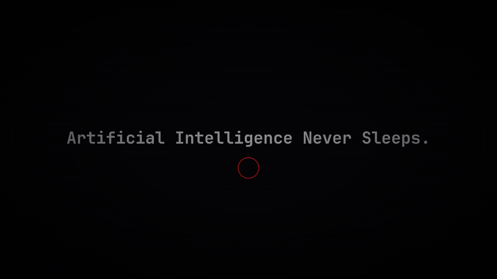

# Artificial Intelligence Never Sleeps

A 2:02.5 audiovisual demo about intelligence emerging from cosmic history,
passing through silicon and machine inference, and reaching a final question:
what happens when the systems never stop? Twenty AI-generated still keyframes
become a continuous 1080p60 production through deterministic camera motion,
procedural terminal scenes, an inference tunnel, audio-reactive effects and a
custom post-processing pipeline. No pre-rendered animation is played by the
live engine.

Built for—and qualified for—the Assembly Summer 2026 AI Coding (Vibe Demo)
competition by **ztothez**.

**[Watch Artificial Intelligence Never Sleeps on YouTube](https://www.youtube.com/watch?v=qPIk-mhv-rA)**

[Download the 1080p60 compo capture](capture/compo.mp4)



> [!IMPORTANT]
> Live playback requires `source/audio/playback.wav`; there is deliberately no
> quieter source-master fallback. The launchers create a Python virtual
> environment and install dependencies, so the first launch needs Python 3.10+
> and an internet connection. The finished MP4 can be watched without Python.

## One engine, two playback paths

The same Python renderer produces the live show and the final video. They are
not separate implementations:

```text
source/timeline.py          24-segment, 122.5-second master timeline
source/demo_player.py       live player and shared single-frame renderer
source/parallel_dump.py     deterministic multiprocess frame renderer
source/engine/              assets, FFT, terminal, tunnel and post-processing
source/visuals/raw/         20 generated narrative keyframes
source/audio/               final mix plus music and narration source masters
entry/                      launchers, screenshot and organiser-facing metadata
capture.sh                  validated 1080p60 H.264/AAC capture pipeline
capture/compo.mp4           finished compo video, stored with Git LFS
```

Live playback uses the position of the approved audio mix as its master clock.
If rendering falls behind, late visual frames are skipped instead of allowing
sound and picture to drift apart. Offline rendering uses the exact frame clock
`frame_index / 60`, so any requested frame is a pure function of its timeline
position.

Each frame follows the same pipeline:

1. Locate the active segment on the master timeline.
2. Sample bass and treble envelopes calculated from the music master.
3. Transform or blend the relevant keyframe, or draw a procedural terminal or
   tunnel scene.
4. Apply scanlines, vignette, glitch, shake and cue-specific accents.
5. Present the frame live or write it to the offline PNG sequence.

The still images are source material, not frames from a pre-rendered animation.
Motion, transitions, text, the binary tunnel and audio response are generated
by the runtime.

## Run the demo

### Linux and macOS

```bash
git clone https://github.com/ztothez/Artificial-Intelligence-Never-Sleeps.git
cd Artificial-Intelligence-Never-Sleeps
./entry/run.sh
```

### Windows

Clone or download the repository, then run:

```bat
entry\run.bat
```

Both launchers create `.venv` when needed, upgrade `pip`, install the compatible
binary packages from `requirements.txt`, and start the required final audio mix
at unity gain.

Useful modes:

```text
./entry/run.sh                                      fullscreen 1920×1080
./entry/run.sh --windowed --resolution 960x540      smaller preview window
./entry/run.sh --native-4k                          3840×2160 render canvas
.venv/bin/python source/demo_player.py \
  --headless --duration 5                           silent five-second smoke test
```

Press `Esc` or `Q` to quit. The mouse cursor is hidden during playback.

To manage the environment manually instead:

```bash
python3 -m venv .venv
source .venv/bin/activate
python -m pip install -r requirements.txt
python source/demo_player.py --audio
```

The runtime dependencies are intentionally small: `pygame-ce`, NumPy and
Pillow.

## Build the final capture

The committed video is the official playback/upload artifact. Rebuilding it
requires `ffmpeg` and `ffprobe` in addition to the Python dependencies:

```bash
ZTTZ_CAPTURE_WORKERS=8 ./capture.sh
```

`capture.sh` renders all 7,350 frames to `capture/raw_frames/`, verifies the
complete 1920×1080 PNG sequence, encodes H.264 video, muxes the required final
audio mix, validates every stream, and only then replaces
`capture/compo.mp4`. Set `ZTTZ_CAPTURE_WORKERS` to a positive integer suitable
for the machine; the default is 8.

The raw frames and intermediate capture files are intentionally ignored by
Git. The finished MP4 is tracked with Git LFS. If a clone contains only a small
text pointer in its place, install Git LFS and run:

```bash
git lfs pull
```

## Video and audio

| Property | Value |
|---|---|
| Duration | 122.5 seconds / 7,350 frames |
| Video | H.264, 1920×1080, 60 fps, YUV 4:2:0 |
| Audio | AAC mono, 48 kHz |
| Live master | `source/audio/playback.wav`, 48 kHz mono PCM |
| Loudness | -15.61 LUFS integrated, -1.42 dBTP |
| Source masters | `source/audio/music.wav` and `source/audio/narration.wav` |

`playback.wav` is the approved narration-and-music mix used by both the live
player and capture builder. `music.wav` remains the source for the runtime FFT;
`narration.wav` is retained as the voice source master. Alternate `compo*.mp4`
files from development are not submission masters.

## AI-assisted production

This demo was built with AI tools under human direction. The production split
was:

| Area | Tools and role |
|---|---|
| Code | Cursor / Claude for the engine, player, timeline and packaging; OpenAI Codex / GPT-5.5 for Phase 4 implementation, optimization, deterministic validation and integration |
| Visuals | Together FLUX.1-schnell / FLUX.1.1-pro for narrative keyframes; OpenAI / ChatGPT image generation for the matched city lights-on and total-power-failure frames |
| Voice | Together Orpheus TTS with ffmpeg robot post-processing |
| Music | Suno / Stable Audio 3 via the original music-generation workflow |
| Human | Direction, story, timeline, synchronization and copyright review |

See [`entry/readme.txt`](entry/readme.txt) for the full organiser-facing AI and
music disclosure, including hashes for the two matched blackout frames.

## Verification

The committed capture was validated as 1920×1080 H.264 at 60 fps with 48 kHz
mono AAC audio and an exact duration of 122.5 seconds. The live and offline
paths share `FrameRenderer`, preventing the two render implementations from
drifting apart.

Repository checks:

```bash
bash -n entry/run.sh capture.sh
python3 -m py_compile source/demo_player.py source/timeline.py source/engine/*.py
.venv/bin/python source/demo_player.py --headless --duration 5
ffprobe -v error -show_streams -show_format capture/compo.mp4
```

The live source does not use OpenCV or play a hidden video file; it renders the
timeline from source assets and procedural effects.

## Competition status

The entry qualified for the Assembly Summer 2026 AI Coding (Vibe Demo)
competition. The field contained 22 entries. No numerical jury score or written
jury comments were published for this entry.
